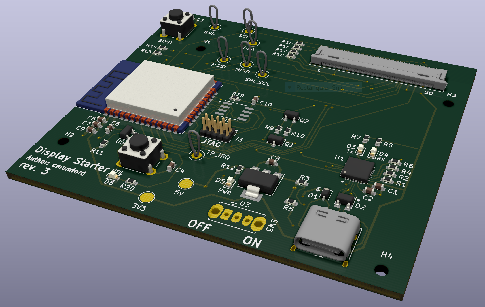

# Introduction

This is a simple hardware/software starter project containing an
MCU (ESP32), and a capacitive touch screen. Nothing fancy, just
something to fork when starting a new project that needs these capabilities.

# Main Components

* ESP32-WROOM-32E ([Datasheet](https://www.espressif.com/sites/default/files/documentation/esp32-wroom-32e_esp32-wroom-32ue_datasheet_en.pdf))
* CP2102N ([Datasheet](https://www.silabs.com/documents/public/data-sheets/cp2102n-datasheet.pdf))
* SPIRAM.
* [2.8" TFT Display - 240x320 with Capacitive Touchscreen](https://www.adafruit.com/product/2770)
* 10-pin JTAG debug port.

# Board Design

See the [pcb/](pcb/) folder for the schematic and board layout.

# Software

It includes a starter application built with the
[ESP-IDF](https://github.com/espressif/esp-idf) platform framework. The application
[lv_demos](https://github.com/lvgl/lv_demos) which is part of the [LVGL](https://lvgl.io/)
graphics library. This could easily be replaced with a different application
